# Documentation du plugin Jeedom Connect


Télécharger l'application au format APK : https://github.com/jared-94/JeedomConnect/releases/latest


1. [Présentation du projet](#presentation)
2. [Fonctionnalités](#fonctionalites)
3. [Screenshots](#screenshots)
4. [Installation du plugin](#install)
5. [Configuration du plugin](#configurePlugin)
6. [Ajouter des équipements](#addEq)
7. [Configuration d'un équipement](#configureEq)

## Présentation du projet <a name="presentation"></a>
Le projet **Jeedom Connect** se compose de 2 parties : un plugin pour Jeedom, et une application Android. Une version pour iOS pourra être envisagée plus tard.

L'application utilise la plupart des éléments de navigation d'une application : un drawer (menu dépliable sur la gauche), un menu bas, un menu haut, et des listes accordéon. Tous ceux-ci sont personalisables à partir du plugin.

La brique de base est la notion de *widget*, qui va représenter un "équipement domotique" (une alarme, une lumière, une info température...). Contrairement à l'application mobile officielle, Jeedom Connect n'ira pas chercher vos équipements / commandes pour vous les afficher directement. C'est à vous de définir un à un vos widgets. Ceci permet une flexibilité au niveau du rendu final.

Le plugin, ainsi que l'application sont complètement **gratuit** et le resteront. Je ne suis pas développeur et fais ça sur mon temps libre, relativement limité. Si vous souhaitez **soutenir le projet**, vous pouvez suggérer des améliorations, signaler des bugs et contribuer au code du plugin si vous avez des notions de PHP/JS/HTML, ou de l'application si vous maîtriser le React Native.

## Fonctionnalités <a name="fonctionalites"></a>
- Affichage et gestion de vos équipements domotiques et des scénarios
- Historiques sous forme de graphique ou tableau
- Possibilité de sécuriser toutes les action avec données biométriques
- Personalisation poussée de l'interface
- Notifications Push enrichies compatibles avec Ask
- Géolocalisation avec gestion avancée de la batterie
- Communication via le protocole WebSocket à faible latence, ou bien en HTTP
- Thème personalisable (couleur, mode sombre)

## Screenshots <a name="screenshots"></a>
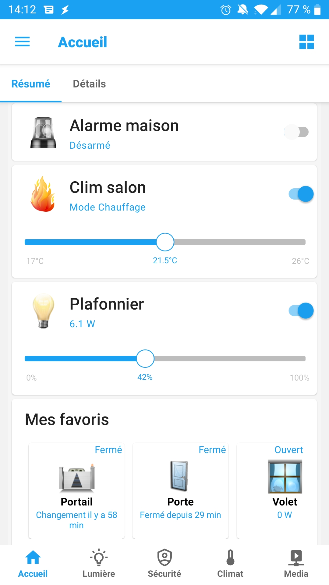
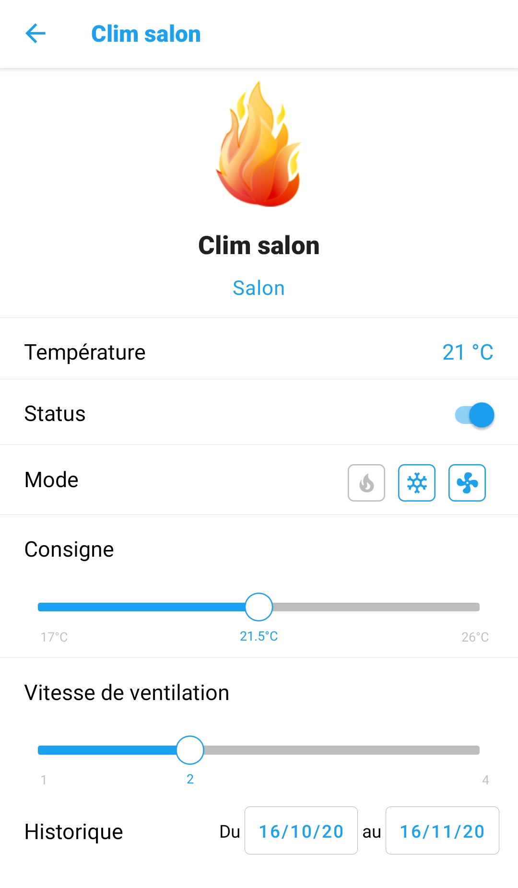
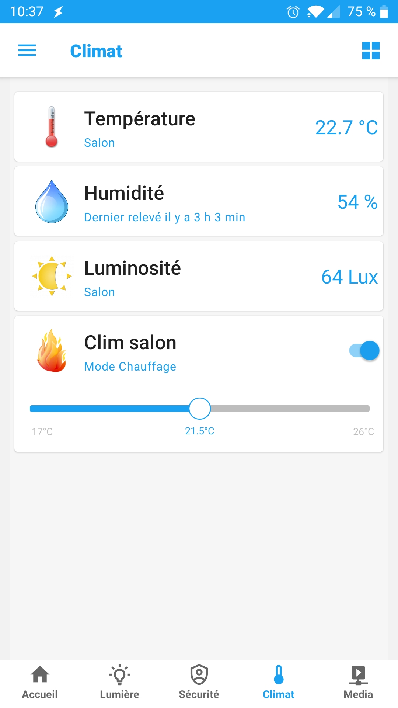
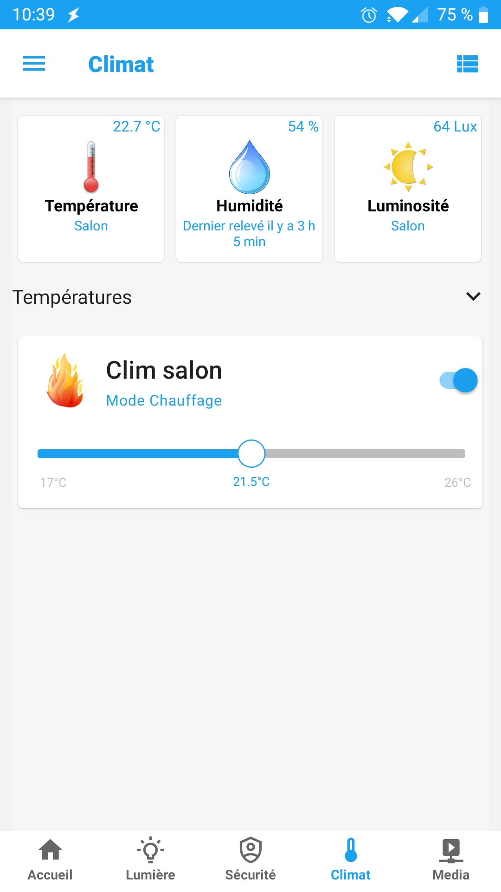
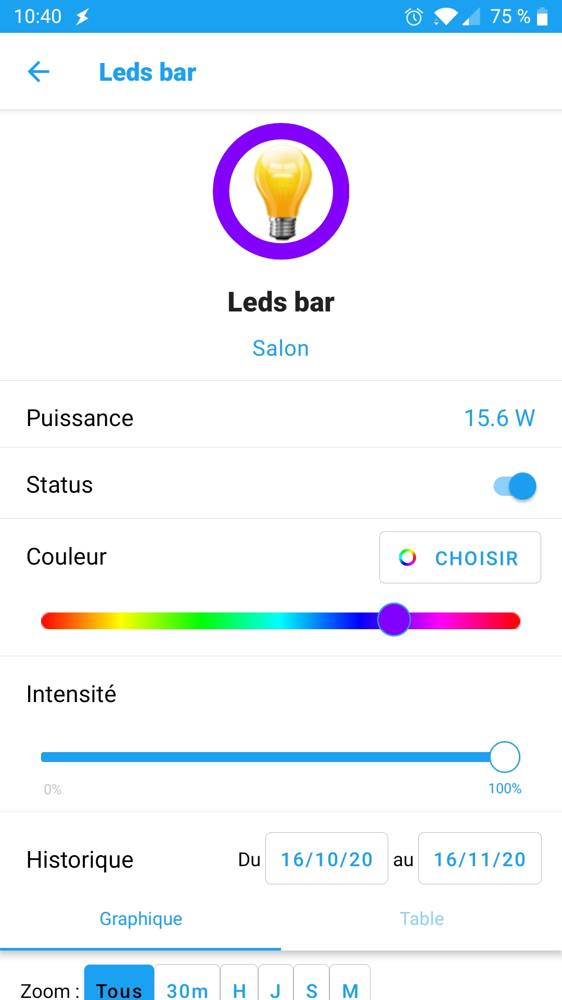
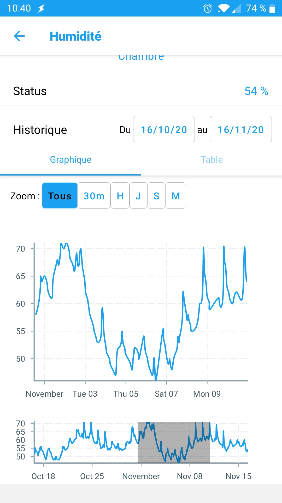
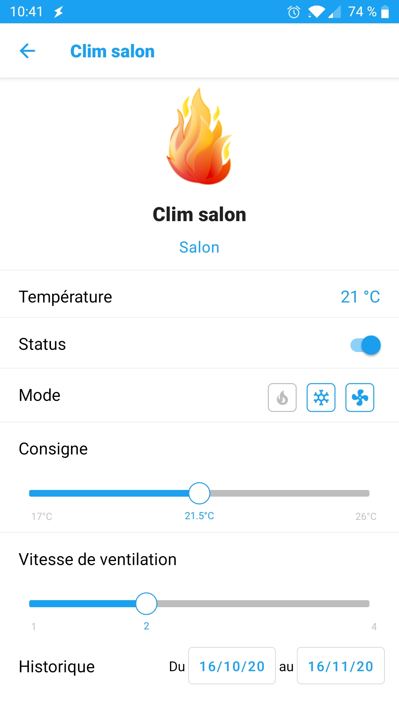
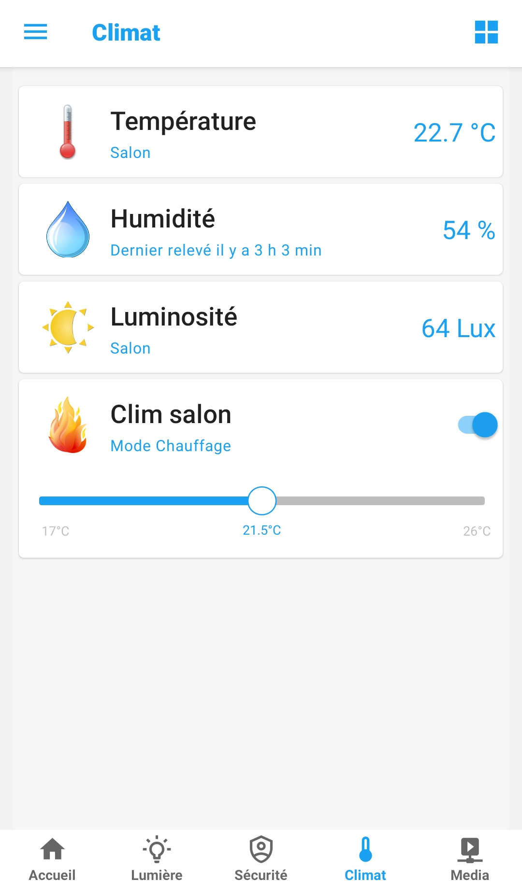
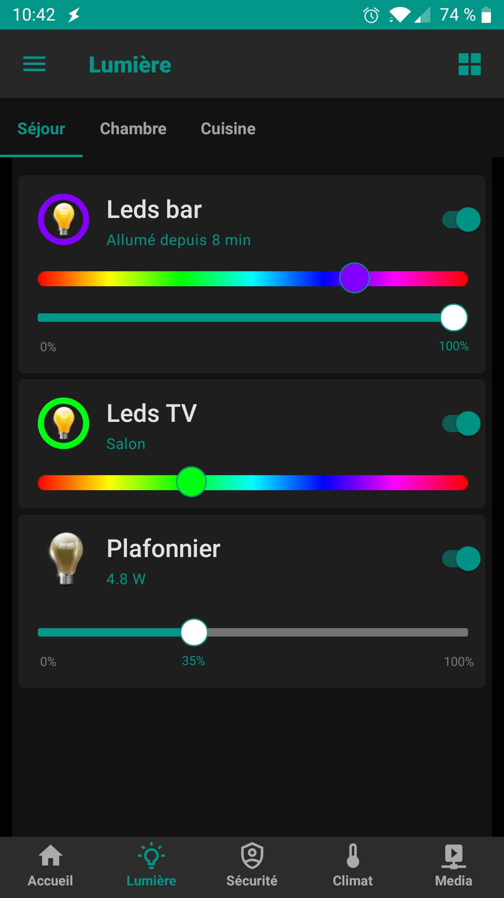

## Installation du plugin <a name="install"></a>
Il s'installe depuis le market comme les autres (pour l'instant disponible en version beta).
Le démon doit être démarré pour le bon fonctionnement.

## Configuration du plugin <a name="configurePlugin"></a>
Il y a plusieurs champs  pré-remplis que vous pouvez modifier. Des placeholder sont indiqués sur chacun d'entre eux. S'ils vous semblent corrects, inutile de les modifier.
* **Adresse http externe** : Indiquez ici votre adresse d'accès à Jeedom depuis l'extérieur de votre domicile.
* **Adresse http interne** : Adresse de Jeedom sur votre réseau local.
* **Activer la connexion par Websocket** : Indiquera à l'application si vous préférez utiliser le protocole Websocket pour la communication avec vos appareils. Notez tout de même que l'adresse HTTP est nécessaire au bon fonctionement de certains services (images persos, géolocalisation, actions sur notifications)
* **Port d'écoute du websocket** : Sauf si vous avez une application qui utilise ce port, vous n'avez pas besoin de le modifier. En cas de modification, n'oubliez pas de redémarrer le démon.
* **Adresse externe websocket** : Adresse websocket accessible depuis l'extérieur (nécessite une configuration de votre réseau)
* **Adresse interne websocket** : Adresse websocket sur votre réseau local

Si vous modifiez un de ces champs, il faudra bien sûr sauvegarder, puis re-générer les QR Code des équipements. En cas d'utilisation du HTTP, il faudra aussi redémarrer l'appli.

## Ajouter des équipements <a name="addEq"></a>
Vous pouvez ajouter des équipements dans le plugin de façon standard.

1 équipement = 1 appareil muni de l'application

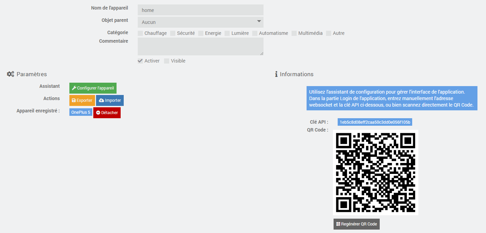

A la création d'un équipement, une clé API, ainsi qu'un QR Code est automatiquement généré avec les informations de configuration du plugin. Lors du démarrage de l'application, vous pourrez alors entrer manuellement vos identifiants jeedom, ou bien scanner le QR Code. Une fois connecté, l'équipement et l'appareil sont liés. Pour vous connecter avec un autre appareil, il vous faut le *détacher*  en cliquant sur le bouton associé.

La configuration d'un équipement consiste en un fichier JSON configurable avec l'assistant, et que vous pouvez exporter / importer. Si vous voulez par exemple cloner un équipement, ajoutez en un nouveau et utiliser l'exportation / importation.

## Configuration d'un équipement <a name="configureEq"></a>
La configuration du contenu de l'application se passe dans l'assistant.

 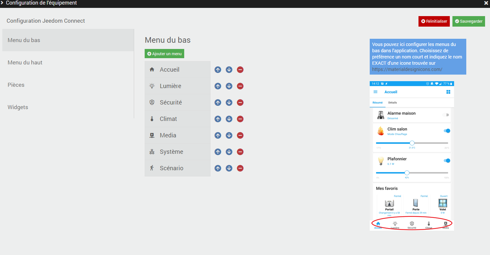

Le changement de configuration a lieu à chaque click sur le bouton *Sauvegarder*. Si l'application est démarrée, elle est automatiquement transférée. Si vous pensé avoir une erreur (par exemple supprimé un élément par erreur), actualisez simplement la page. Le bouton *Réinitialiser* (suivi de *Sauvegarder*) remet toute la configuration à zéro, attention donc !

* ### Menu du bas
Cette partie est assez explicite, elle permet de configurer les onglets qui apparaissent en bas de l'écran. Le coix des icône se fait sur https://materialdesignicons.com/ (un moteur de recherche est intégré).  
Vous pouvez choisir de ne configurer cette partie si vous ne voulez pas de navigation par ces onglets.

* ### Menu du haut
 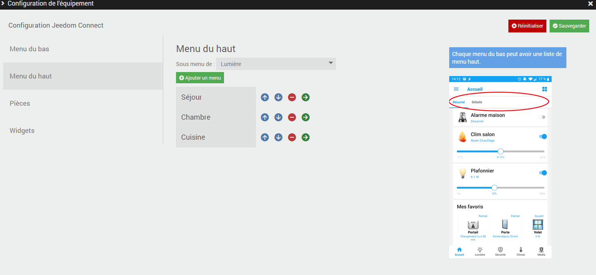

 Cette partie est également explicite. Un menu sous forme d'onglets en haut de l'écran que vous pouvez 'slider'. Egalement facultatif.

* ### Pièces
 Chaque widget peut être associé à une pièce à ajouter dans cette partie.

* ### Widgets
 
 C'est ici qu'on configure les widgets affichés dans l'application. Placez-vous tout d'abord sur le menu / sous-menu que vous voulez configurer. Les différents éléments être peuvent bougés avec les boutons 'flèches' et 'supprimer'.
 * **Ajouter un groupe** : Vous pouvez ranger vos widgets dans un menu dépliable (type "acordéon").
 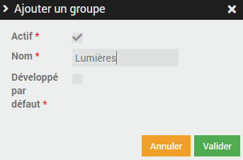
   * **Actif** : Le groupe sera (ne sera pas) affiché dans l'application.
   * **Développé par défaut** : Le comportement par défaut (plié / déplié) du menu.
 * **Ajouter un widget** : Ajoutez autant de widgets de que vous souhaitez ! Certains champs sont commun à (presque) tous les widgets :
   * **Actif** : Le widget sera (ou pas) affiché dans l'application. Pratique si vous voulez par exemple gérer un groupe de lumières, mais ne pas afficher certaines d'entre elles.
   * **Pièce** : Sélection de la pièce associée (du menu Pièces)
   * **Nom** : Nom du widget
   * **Sous-titre** Information complémentaire affichée dans l'application. Le mode personalisé permet de mettre une phrase quelconque, avec certains "mots-clé", généralement `room`, `value`, `formatedValue`, `elapsedTime`, `power`. Par exemple :

   ```Mon ampoule est formatedValue depuis elapsedTime et consomme power W```

   pourra donner :

   ```Mon ampoule est allumée depuis 1h12min et consomme 15W```
   * **Affichage forcé** : De façon standard, chaque widget (sauf exception) possède 3 types d'affichage : carte, vignette et détail. Les affichages carte et vignettes peuvent être choisis via l'icône en haut à droite dans l'application. L'affichage détail est une page entière affichée quand on click sur le widget. Vous pouvez ici forcer un widget à s'afficher d'une de ces 3 façons.  
   Attention pour le mode détail, le widget doit être seul sur sa page.
   * **Sécuriser les actions** : Toutes les commandes de type action peuvent être sécurisées à l'aide de ces deux boutons :

     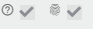   
   Le premier permet de faire une simple demande de confirmation de l'action, le second demande l'empreinte digitale pour exécuter l'action (sur appareils disposant d'un capteur)

* ### Widgets disponibles
 * Lumière On/Off
 * Lumière à variation
 * Lumière de couleurs
 * Groupe de lumières
 * Scénario
 * Résumé
 * Favoris
 * Luminosité
 * Humidité
 * Température
 * Puissance
 * Climatiseur
 * Porte
 * Groupe de portes
 * Fenêtre
 * Groupe de fenêtres
 * Portail coulissant
 * Volet
 * Groupe de volets
 * PIR
 * Alarme
 * Groupe d'alarmes
 * Générique binaire
 * Générique numérique
 * Générique texte
 * Générique switch
 * Générique actions
 * Mode
